# Image Segmentation using clustering methods

[![github-badge][github-badge]][github]

## Authors

| Name           | ID   |
| -------------- | ---- |
| Fatema Moharam | 6655 |
| Aya Naga       | 6376 |
| Mariam Bardesy | 6200 |

K-means:

[![colab-badge][colab-badge]][colab-notebook]

Spatial Encoded Clustering:

[![colab-badge][colab-badge]][colab-notebook-pos]

Spectral Clustering:

[![colab-badge][colab-badge]][colab-notebook-spec]

## Table of Contents

- [Image Segmentation using clustering methods](#image-segmentation-using-clustering-methods)
  - [Table of Contents](#table-of-contents)
  - [Exploring the dataset](#exploring-the-dataset)
  - [Exploring Data](#exploring-data)
  - [Display the images and their ground truth](#display-the-images-and-their-ground-truth)
  - [Segmentation using K-Means](#segmentation-using-k-means)
    - [Different number of clusters](#different-number-of-clusters)
    - [K-means Evaluation](#k-means-evaluation)
  - [Computing F-measure](#computing-f-measure)
  - [Computing Conditional Entropy](#computing-conditional-entropy)
  - [Results of K-means segmentation](#results-of-k-means-segmentation)
    - [F-measure](#f-measure)
      - [Best 5 F scores](#best-5-f-scores)
      - [Worst 5 F scores](#worst-5-f-scores)
    - [Conditional Entropy](#conditional-entropy)
      - [Best 5 conditional entropy](#best-5-conditional-entropy)
      - [Worst 5 conditional entropy](#worst-5-conditional-entropy)
      - [Images](#images)
    - [Best entropy at k = 3](#best-entropy-at-k--3)
    - [Best entropy at k = 5](#best-entropy-at-k--5)
    - [Best entropy at k = 7](#best-entropy-at-k--7)
    - [Best entropy at k = 9](#best-entropy-at-k--9)
    - [Best entropy at k = 11](#best-entropy-at-k--11)
    - [Best F-measure at k = 3](#best-f-measure-at-k--3)
    - [Best F-measure at k = 5](#best-f-measure-at-k--5)
    - [Best F-measure at k = 7](#best-f-measure-at-k--7)
    - [Best F-measure at k = 9](#best-f-measure-at-k--9)
    - [Best F-measure at k = 11](#best-f-measure-at-k--11)
    - [Worst entropy at k = 3](#worst-entropy-at-k--3)
    - [Worst entropy at k = 5](#worst-entropy-at-k--5)
    - [Worst entropy at k = 7](#worst-entropy-at-k--7)
    - [Worst entropy at k = 9](#worst-entropy-at-k--9)
    - [Worst entropy at k = 11](#worst-entropy-at-k--11)
    - [Worst F-measure at k = 3](#worst-f-measure-at-k--3)
    - [Worst F-measure at k = 5](#worst-f-measure-at-k--5)
    - [Worst F-measure at k = 7](#worst-f-measure-at-k--7)
    - [Worst F-measure at k = 9](#worst-f-measure-at-k--9)
    - [Worst F-measure at k = 11](#worst-f-measure-at-k--11)
  - [Encoding Spatial Information](#encoding-spatial-information)
  - [Results of spatial encoded clustering](#results-of-spatial-encoded-clustering)
    - [F-measure](#f-measure-1)
      - [Best 5 F scores](#best-5-f-scores-1)
      - [Worst 5 F scores](#worst-5-f-scores-1)
    - [Conditional Entropy](#conditional-entropy-1)
      - [Best 5 Entropies](#best-5-entropies)
      - [Worst 5 Entropies](#worst-5-entropies)
      - [Images](#images-1)
        - [Best Entropy at k = 3](#best-entropy-at-k--3-1)
        - [Best Entropy at k = 5](#best-entropy-at-k--5-1)
        - [Best Entropy at k = 7](#best-entropy-at-k--7-1)
        - [Best Entropy at k = 9](#best-entropy-at-k--9-1)
        - [Best Entropy at k = 11](#best-entropy-at-k--11-1)
        - [Best F-measure at k = 3](#best-f-measure-at-k--3-1)
        - [Best F-measure at k = 5](#best-f-measure-at-k--5-1)
        - [Best F-measure at k = 7](#best-f-measure-at-k--7-1)
        - [Best F-measure at k = 9](#best-f-measure-at-k--9-1)
        - [Best F-measure at k = 11](#best-f-measure-at-k--11-1)
        - [Worst Entropy at k = 3](#worst-entropy-at-k--3-1)
        - [Worst Entropy at k = 5](#worst-entropy-at-k--5-1)
        - [Worst Entropy at k = 7](#worst-entropy-at-k--7-1)
        - [Worst Entropy at k = 9](#worst-entropy-at-k--9-1)
        - [Worst Entropy at k = 11](#worst-entropy-at-k--11-1)
        - [Worst F-measure at k = 3](#worst-f-measure-at-k--3-1)
        - [Worst F-measure at k = 5](#worst-f-measure-at-k--5-1)
        - [Worst F-measure at k = 7](#worst-f-measure-at-k--7-1)
        - [Worst F-measure at k = 9](#worst-f-measure-at-k--9-1)
        - [Worst F-measure at k = 11](#worst-f-measure-at-k--11-1)
  - [Conclusion](#conclusion)

## Exploring the dataset

## Exploring Data

We use the [BSR_BSDS500][data] dataset, A large dataset of natural images that have been manually segmented. The human annotations serve as ground truth for learning grouping cues as well as a benchmark for comparing different segmentation and boundary detection algorithms. We report our results on the first 50 images of the test set.

Folder tree

```text
IN
|_Images
| |_val
| | |_ ....jpg
| | |_ Thumbs.db
| |_train
| | |_ ....jpg
| | |_ Thumbs.db
| |_test
|   |_ ....jpg
|   |_ Thumbs.db
|
|_groundTruth
  |_val
  | |_ ....mat
  |_train
  | |_ ....mat
  |_test
    |_ ....mat
```

Image shape: (321, 481, 3)

![explore][explore]

test samples: 50 50

## Display the images and their ground truth

We write the following function to display an image with its corresponding ground truth. We use the `imshow` function from `matplotlib` to display the images. We reverse the order of the color channels to display the images in RGB format, as opposed to the BGR format used by OpenCV.

```python
def disp_img_truth(img,truth,edges=True,gray=False):
  fig = plt.figure(figsize=(30,10))
  n = len(truth['groundTruth'][0])
  ax_img = fig.add_subplot(1,n+1,1)
  ax_img.imshow(img[:,:,::-1]) if not gray else ax_img.imshow(img)
  ax_img.axis('off')

  ax_gt = []
  for i,gt in enumerate(truth['groundTruth'][0]):
    ax_gt.append(fig.add_subplot(1,n+1,i+2))
    if edges:
      ground_truth = gt[0][0][1]
      ax_gt[-1].imshow(-1*ground_truth.astype(np.uint8),cmap='gray')
    else:
      ground_truth = gt[0][0][0]
      ax_gt[-1].imshow(ground_truth.astype(np.uint8))
    ax_gt[-1].axis('off')

  plt.show()
```

The function can show either the edges or the segments of the ground truth based on the input parameter `edges`.

```python
disp_img_truth(x_test[0],y_test[0],edges=False)
```

![segments][segments]

```python
disp_img_truth(x_test[0],y_test[0],edges=True)
```

![edges][edges]

## Segmentation using K-Means

We write a k-means class that is general enough to be used for any data.

```python
class K_Means:
  def __init__(self,k=3):
    self.k = k
    self.centroids = None
    self.labels = None

  def fit(self,x_train, max_iter=100):
    # put the data in the right format
    if x_train.ndim != 2:
      x_train = x_train.reshape((-1,x_train.shape[-1]))

    # initialize the centroids
    self.centroids = np.random.choice(x_train.shape[0],self.k,replace=False)
    self.centroids = x_train[self.centroids]

    it = 0
    while it < max_iter:
      it += 1
      # calculate the distance between each point and each centroid
      dist = np.linalg.norm(x_train[:,np.newaxis]-self.centroids[np.newaxis],axis=-1)
      # assign each point to the closest centroid
      self.labels = np.argmin(dist,axis=-1)
      # calculate the new centroids
      new_centroids = np.zeros_like(self.centroids)
      for i in range(self.k):
        # calculate the mean of all points assigned to the centroid
        new_centroids[i] = np.mean(x_train[self.labels==i],axis=0)
      # check the stopping condition
      if np.all(new_centroids == self.centroids):
        break
      self.centroids = new_centroids

  def predict(self,x_test):
    # put the data in the right format
    if x_test.ndim != 2:
      x_test = x_test.reshape((-1,x_test.shape[-1]))

    # calculate the distance between each point and each centroid
    dist = np.linalg.norm(x_test[:,np.newaxis]-self.centroids[np.newaxis],axis=-1)
    # assign each point to the closest centroid
    return np.argmin(dist,axis=-1)

```

The function `fit` takes as input the training data and the maximum number of iterations. It initializes the centroids randomly and then iterates until the centroids don't change or the maximum number of iterations is reached. The function `predict` takes as input the test data and returns the labels of the test data.

We then write a helper function to initialize the classifier, train it and predict the labels of the test data.

> **Note**: The feature vector passed to the classifier is
> normalized.

The `position` parameter will let us encode spatial information later usin a function `encode_position`. For now, we set the default to `False`.

```python
def k_means(k, img, position = False):
  fitted = K_Means(k)
  img = encode_position(img/255.) if position else (img / 255.)
  fitted.fit(img)
  labels = fitted.predict(img)

  return labels.reshape(img.shape[:2])
```

```python
plt.imshow(k_means(5,x_test[5]))
```

![kmeans][kmeans]

### Different number of clusters

For each image, we save the labels of the image for different numbers of clusters: `[3, 5, 7, 9, 11]`.

```python
def get_all_labels(X, n = [3,5,7,9,11], position = False):
  y_pred = []
  for x in X:
    y = []
    for k in n:
      y.append(k_means(k,x,position = position))
    y_pred.append(y)
  return y_pred
```

The following function will write the data as PNG images using openCV library.

```python
def save_all_labels(y_pred,dir):
  for i in range(len(y_pred)):
    path = f'{dir}/{i}'
    os.mkdir(path)
    for j,y in enumerate(y_pred[i]):
      y = 255. * y / max(np.max(y),1)
      cv2.imwrite(f'{path}/{j}.png',y)
```

```python
y_pred = get_all_labels(x_test)
```

```python
save_all_labels(y_pred, f'{OUT}/test')
```

View the saved result [here][test_label].

### K-means Evaluation

> The following procedures will be carried on for each image I, each number of clusters K, and each ground truth M.

We evaluate our clustering usin external measures. We use the [F-measure][f] and the [Conditional Entropy][ce].

In order to compute either of the external measures correctly, we need to assign labels using maximum matching.

We calculate all contingency matrices. We use the function `sklearn.metrics.cluster.contingency_matrix` to calculate the contingency matrix.

```python
def contingency(y_pred,y_true):
    contingency_matrices = np.zeros((len(y_pred[0]),len(y_pred),),dtype=object)
    for k in range(len(y_pred[0])):
    # for each k in [3,5,7,9,11]
        for i in range(len(y_pred)):
            # for each image i
            temp = np.zeros((len(y_true[i]['groundTruth'][0]),),dtype = object)
            for m, gt in enumerate(y_true[i]['groundTruth'][0]):
                # each image i has m ground truths
                ground_truth = gt[0][0][0]
                temp[m] = contingency_matrix(ground_truth, y_pred[i][k])
            contingency_matrices[k,i] = temp.copy()
            del temp
    return contingency_matrices
```

After Acquiring the contingency matrices, we can solve for bipartite graph matching (Maximum matching).

![maxmatch][maxmatch]

```python
def max_match_one_img(contingency, y_true,y_pred):
    y_new = y_pred.copy()
    true_unique = np.unique(y_true)
    pred_unique = np.unique(y_pred)
    mapping = np.zeros(pred_unique.shape+ (2,))
    for c in range(contingency.shape[-1]):
        best_match = np.argmax(contingency[:,c])
        y_new[y_pred == pred_unique[c]] = true_unique[best_match]
        mapping[c] = [pred_unique[c],true_unique[best_match]]
    return y_new, mapping
```

```python
def max_match_all(contingencies,y_true,y_pred):
    y_pred_matched = np.zeros(y_pred.shape , dtype=object)
    for k in range(len(y_pred[0])):
    # for each k in [3,5,7,9,11]
        for i in range(len(y_pred)):
            # for each image i
            y_pred_matched[i,k] = np.zeros((len(y_true[i]['groundTruth'][0]),) + y_pred[i,k].shape)
            for m, gt in enumerate(y_true[i]['groundTruth'][0]):
                # each image i has m ground truths
                ground_truth = gt[0][0][0]
                contingency = contingencies[k,i][m]
                y_pred_matched[i,k][m] = max_match_one_img(contingency,ground_truth,y_pred[i,k])[0]
    return y_pred_matched
```

We can now calculate the F-measure.

## Computing F-measure

![F measure][fscore]

```python
def f_measure_all(y_true,y_pred):
    f_measure = np.zeros(y_pred.shape , dtype=object)
    avg = 0
    count = 0
    for k in range(len(y_pred[0])):
    # for each k in [3,5,7,9,11]
        for i in range(len(y_pred)):
            # for each image i
            f_measure[i,k] = np.zeros((len(y_true[i]['groundTruth'][0])+1,))
            for m, gt in enumerate(y_true[i]['groundTruth'][0]):
                # each image i has m ground truths
                ground_truth = gt[0][0][0]
                f_measure[i,k][m] = f1_score(ground_truth.reshape((-1,)),y_pred[i,k][m].reshape((-1,)),average='macro')
                avg = avg + f_measure[i,k][m]
                count = count + 1
            f_measure[i,k][-1] = np.mean(f_measure[i,k][:-1]) # average
    return f_measure, avg / count
```

We compute the F-measure for each image, each number of clusters, and each ground truth, and then we average the F-measure for each image and each number of clusters.

## Computing Conditional Entropy

![Conditional Entropy][ce-pic]

```python
def conditional_entropy(y_true, y_pred):
    n = y_pred.shape[0]
    cond_ent = 0
    for c in np.unique(y_pred):
        # for each cluster c in clustering
        nc = (y_pred == c).shape[0]
        ent = 0
        for k in np.unique(y_true):
            # for each label in the cluster
            nkc = (y_true[y_pred == c] == k).shape[0]
            p = nkc / nc
            ent = ent + -1 * p * np.log(p)
        cond_ent = cond_ent + ent * nc / n
    return cond_ent

def conditional_entropy_all(y_true,y_pred):
    ent = np.zeros(y_pred.shape , dtype=object)
    avg = 0
    count = 0
    for k in range(len(y_pred[0])):
    # for each k in [3,5,7,9,11]
        for i in range(len(y_pred)):
            # for each image i
            ent[i,k] = np.zeros((len(y_true[i]['groundTruth'][0])+1,))
            for m, gt in enumerate(y_true[i]['groundTruth'][0]):
                # each image i has m ground truths
                ground_truth = gt[0][0][0]
                ent[i,k][m] = conditional_entropy(ground_truth.reshape((-1,)),y_pred[i,k][m].reshape((-1,)))
                avg = avg + ent[i,k][m]
                count = count + 1
            ent[i,k][-1] = np.mean(ent[i,k][:-1]) # average
    return ent, avg / count
```

## Results of K-means segmentation

K-means image segmentation for the whole dataset results in an average F-measure of
_0.17_, and an average conditional entropy of _19.22_.

![measures][measures]

```text
 k = 0
	 	  m = 0
	 	 	 F-measure = 0.4348674289562684
	 	 	 Conditional Entropy = 0.0
	 	  m = 1
	 	 	 F-measure = 0.4348488120555046
	 	 	 Conditional Entropy = 0.0
	 	  m = 2
	 	 	 F-measure = 0.2525853098617235
	 	 	 Conditional Entropy = 0.0
	 	  m = 3
	 	 	 F-measure = 0.15021576914521445
	 	 	 Conditional Entropy = 0.0
	 	  m = 4
	 	 	 F-measure = 0.33564332844263234
	 	 	 Conditional Entropy = 0.9737068304661309
Average F-measure = 0.3216321296922686
Average Conditional Entropy = 0.19474136609322618
	 k = 1
	 	  m = 0
	 	 	 F-measure = 0.4348674289562684
	 	 	 Conditional Entropy = 0.0
	 	  m = 1
	 	 	 F-measure = 0.4348488120555046
	 	 	 Conditional Entropy = 0.0
	 	  m = 2
	 	 	 F-measure = 0.3205371409375046
	 	 	 Conditional Entropy = 0.719605792256861
	 	  m = 3
	 	 	 F-measure = 0.19028568684731795
	 	 	 Conditional Entropy = 1.1993429870947685
	 	  m = 4
	 	 	 F-measure = 0.31742638667218886
	 	 	 Conditional Entropy = 0.719605792256861
Average F-measure = 0.3395930910937569
Average Conditional Entropy = 0.527710914321698
	 k = 2
	 	  m = 0
	 	 	 F-measure = 0.4348674289562684
	 	 	 Conditional Entropy = 0.0
	 	  m = 1
	 	 	 F-measure = 0.4348488120555046
	 	 	 Conditional Entropy = 0.0
	 	  m = 2
	 	 	 F-measure = 0.3121401830291917
	 	 	 Conditional Entropy = 0.6095938176932034
	 	  m = 3
	 	 	 F-measure = 0.18523122755081106
	 	 	 Conditional Entropy = 1.015989696155339
	 	  m = 4
	 	 	 F-measure = 0.30912005852838215
	 	 	 Conditional Entropy = 0.6095938176932034
Average F-measure = 0.33524154202403156
Average Conditional Entropy = 0.44703546630834917
	 k = 3
	 	  m = 0
	 	 	 F-measure = 0.4348674289562684
	 	 	 Conditional Entropy = 0.0
	 	  m = 1
	 	 	 F-measure = 0.4348488120555046
	 	 	 Conditional Entropy = 0.0
	 	  m = 2
	 	 	 F-measure = 0.3063056639012983
	 	 	 Conditional Entropy = 0.5398880869119573
	 	  m = 3
	 	 	 F-measure = 0.18181091089867485
	 	 	 Conditional Entropy = 0.8998134781865957
	 	  m = 4
	 	 	 F-measure = 0.3032836940049894
	 	 	 Conditional Entropy = 0.5398880869119573
Average F-measure = 0.33222330196334704
Average Conditional Entropy = 0.3959179304021021
	 k = 4
	 	  m = 0
	 	 	 F-measure = 0.4348674289562684
	 	 	 Conditional Entropy = 0.0
	 	  m = 1
	 	 	 F-measure = 0.4348488120555046
	 	 	 Conditional Entropy = 0.0
	 	  m = 2
	 	 	 F-measure = 0.3035426036150093
	 	 	 Conditional Entropy = 0.513729515803707
	 	  m = 3
	 	 	 F-measure = 0.1802423965614268
	 	 	 Conditional Entropy = 0.8562158596728449
	 	  m = 4
	 	 	 F-measure = 0.30055399767689167
	 	 	 Conditional Entropy = 0.513729515803707
Average F-measure = 0.3308110477730201
Average Conditional Entropy = 0.37673497825605173
```

The following are the average results for each number of clusters per image.

### F-measure

|    k=3     |    k=5     |    k=7     |    k=9     |    k=11    |
| :--------: | :--------: | :--------: | :--------: | :--------: |
| 0.20025763 | 0.28088588 | 0.3351878  | 0.31099516 | 0.3576946  |
| 0.18657969 | 0.22069812 | 0.23361991 | 0.07352786 | 0.25088155 |
| 0.38035175 | 0.38313246 | 0.42087126 | 0.4729108  | 0.4861679  |
| 0.16458443 | 0.18857662 | 0.19524966 | 0.24756254 | 0.23253654 |
| 0.12401793 |  0.159595  | 0.16559213 | 0.17192543 | 0.16877383 |
| 0.09018138 | 0.1238526  | 0.1532038  | 0.15647346 | 0.17033714 |
| 0.04474494 | 0.05031892 | 0.05184147 | 0.05435968 | 0.05517804 |
| 0.2306075  | 0.23111832 | 0.23328309 | 0.2354141  | 0.26479682 |
| 0.1451505  | 0.16138501 | 0.19304082 | 0.22040507 | 0.23197478 |
| 0.15834261 | 0.16360234 | 0.1723262  | 0.1727447  | 0.19285347 |
| 0.08933916 | 0.09769211 | 0.10891172 | 0.10611916 | 0.1171444  |
| 0.12265041 | 0.14435327 | 0.18741813 | 0.21836892 | 0.22189046 |
| 0.16909258 | 0.2478994  | 0.30054396 | 0.32505438 | 0.3333766  |
| 0.2922683  | 0.3229981  | 0.39805973 | 0.40292668 | 0.42046043 |
| 0.4523246  | 0.46378922 | 0.5177822  | 0.5128231  | 0.47532406 |
| 0.1002628  | 0.10130657 | 0.1316401  | 0.16427319 | 0.16826373 |
| 0.07140269 | 0.11781246 | 0.04650906 | 0.16916466 | 0.16960752 |
| 0.07618336 | 0.08213326 | 0.08933723 | 0.10068691 | 0.11941899 |
| 0.36105445 | 0.3557749  | 0.38855138 |  0.385377  | 0.38151762 |
| 0.08122677 | 0.08240915 | 0.08267343 | 0.08321618 | 0.08370406 |
| 0.32163212 | 0.33959308 | 0.33524156 | 0.3322233  | 0.33081105 |
| 0.2766552  | 0.33947498 | 0.33375117 | 0.34397143 | 0.35866407 |
| 0.4062462  | 0.5152262  | 0.5138878  | 0.54857874 | 0.5733429  |
| 0.03612803 | 0.04962203 | 0.05252462 | 0.06281728 | 0.08295838 |
| 0.08859985 | 0.15315619 | 0.1572835  | 0.19376616 | 0.19385597 |
| 0.06897718 | 0.13754703 | 0.14981191 | 0.15528768 | 0.15691857 |
| 0.07540194 | 0.11944507 | 0.12310492 | 0.13244823 | 0.13359696 |
| 0.05437353 | 0.05583867 | 0.06232842 | 0.06206353 | 0.06275202 |
| 0.08712307 | 0.13407435 | 0.13652022 | 0.15281124 | 0.01800344 |
| 0.05223036 | 0.08422408 | 0.02371506 | 0.0906459  | 0.09518123 |
| 0.07730724 | 0.09859309 | 0.09701091 | 0.12329083 |  0.139956  |
| 0.03734065 | 0.04896289 | 0.07533571 | 0.08747492 | 0.10078849 |
| 0.28952825 | 0.3329621  | 0.38211405 | 0.45856357 | 0.47266695 |
| 0.1098273  | 0.10422765 | 0.13917318 | 0.15431489 | 0.16250874 |
| 0.05877764 | 0.07004005 | 0.08636666 | 0.08573294 | 0.09330734 |
| 0.04463748 | 0.04709329 | 0.04627372 | 0.05455671 | 0.06268217 |
| 0.10426734 | 0.16009998 | 0.17977865 | 0.17916863 | 0.22323501 |
| 0.08719385 | 0.10393394 | 0.10938974 | 0.11035658 | 0.1203546  |
| 0.1400084  | 0.16788283 | 0.09397785 | 0.22299087 | 0.09397785 |
| 0.05587532 | 0.08555857 | 0.12901199 | 0.16332185 | 0.15198043 |
| 0.23449524 | 0.43170592 | 0.46149734 | 0.42861274 | 0.5059845  |
| 0.15689448 | 0.1620063  | 0.21006504 | 0.26719135 | 0.28877753 |
| 0.06358097 | 0.06787845 | 0.07546274 | 0.08077021 | 0.0916457  |
|  0.079262  | 0.07772063 | 0.10970882 | 0.11134658 | 0.11718474 |
| 0.03703913 | 0.0602504  | 0.0664886  | 0.08864692 | 0.08664846 |
| 0.06904212 | 0.09435088 | 0.11228377 | 0.11353233 | 0.14068593 |
| 0.07069591 | 0.09339724 | 0.10720582 | 0.12320247 | 0.12955365 |
| 0.03254929 | 0.0626825  | 0.10384759 | 0.11223634 | 0.11497956 |
| 0.10636721 | 0.12212301 |  0.199216  | 0.19811356 | 0.19535477 |
| 0.07409034 | 0.07490093 | 0.07970463 | 0.08314122 | 0.0855166  |

#### Best 5 F scores

|    k=3     |    k=5     |    k=7     |    k=9     |    k=11    |
| :--------: | :--------: | :--------: | :--------: | :--------: |
| 0.32163212 | 0.3557749  | 0.39805973 | 0.42861274 | 0.47266695 |
| 0.36105445 | 0.38313246 | 0.42087126 | 0.45856357 | 0.47532406 |
| 0.38035175 | 0.43170592 | 0.46149734 | 0.4729108  | 0.4861679  |
| 0.4062462  | 0.46378922 | 0.5138878  | 0.5128231  | 0.5059845  |
| 0.4523246  | 0.5152262  | 0.5177822  | 0.54857874 | 0.5733429  |

#### Worst 5 F scores

|    k=3     |    k=5     |    k=7     |    k=9     |    k=11    |
| :--------: | :--------: | :--------: | :--------: | :--------: |
| 0.03254929 | 0.04709329 | 0.02371506 | 0.05435968 | 0.01800344 |
| 0.03612803 | 0.04896289 | 0.04627372 | 0.05455671 | 0.05517804 |
| 0.03703913 | 0.04962203 | 0.04650906 | 0.06206353 | 0.06268217 |
| 0.03734065 | 0.05031892 | 0.05184147 | 0.06281728 | 0.06275202 |
| 0.04463748 | 0.05583867 | 0.05252462 | 0.07352786 | 0.08295838 |

### Conditional Entropy

|    k=3     |    k=5    |    k=7     |    k=9     |    k=11    |
| :--------: | :-------: | :--------: | :--------: | :--------: |
| 7.8021955  | 11.559287 | 11.997405  | 11.515504  | 12.499937  |
|  20.28578  | 19.686829 | 22.996708  |     0.     | 23.263746  |
|  6.721931  | 6.7564387 | 7.2282066  |  8.302319  |  8.170541  |
| 13.519988  | 15.442414 | 15.517293  | 16.078154  | 16.044146  |
| 4.5976825  | 6.9208555 | 7.3957353  |  8.098978  |  8.053152  |
| 14.8892975 | 16.173506 | 21.106665  | 23.070421  | 25.880991  |
|  8.844843  | 19.193483 | 15.961545  | 17.271048  | 17.082771  |
| 4.1861267  | 4.3539343 | 4.3101597  | 4.3262897  |  4.940568  |
| 2.1134632  | 4.980739  | 7.8639045  |  7.875701  |  7.764428  |
| 12.834207  | 12.405325 | 13.270289  | 13.272894  | 15.816332  |
|  4.631545  | 5.754315  | 6.6507545  |  7.000621  | 7.4505277  |
|  15.24973  | 14.721121 | 17.159227  | 17.721214  |  17.2665   |
|     0.     | 2.6857648 | 2.1078632  | 2.8097749  |  2.948628  |
|  4.805286  | 5.698943  |  6.718647  | 6.6759367  | 7.0988555  |
| 1.1863565  | 1.5779799 |  2.292769  | 2.0857055  | 1.7915416  |
|  14.26391  | 14.739981 | 17.174652  | 20.108574  |  18.86242  |
|  5.105105  | 10.473491 |     0.     | 13.200926  | 13.184046  |
| 16.091352  | 18.388231 | 22.418133  | 24.230227  | 25.675268  |
|  9.04236   | 7.078466  |  8.559513  | 7.9218826  |  7.566623  |
|  9.73082   | 9.101799  |  9.124215  |  9.242188  |  9.682703  |
| 0.19474137 | 0.5277109 | 0.44703546 | 0.39591792 | 0.37673497 |
| 0.6537997  | 1.5986636 | 1.3441818  | 1.3832912  | 2.8001869  |
| 2.7443686  | 3.7462988 |  3.525183  | 4.6521196  | 4.8527446  |
| 21.360386  | 32.63849  |  31.70809  | 43.353714  | 47.603867  |
| 12.811928  | 21.39184  | 20.713856  | 22.985378  | 22.801863  |
|  10.47198  | 33.364296 |  34.52009  |  33.65045  |  35.18156  |
| 26.048761  | 34.604877 |  35.41358  | 35.521263  |  35.49361  |
|  9.840903  | 11.029086 | 17.294138  | 16.024956  |  16.64937  |
| 28.770435  | 41.95236  | 42.829327  | 45.438416  |     0.     |
| 20.519457  | 41.11736  |     0.     | 42.991703  |  45.62508  |
| 15.586264  | 19.04578  | 20.160913  | 23.553944  | 26.131876  |
| 40.828648  | 48.269882 | 63.323586  |  67.54087  | 65.439476  |
| 4.4146047  | 9.740674  |  8.841147  | 12.783245  | 12.676358  |
| 13.835506  | 13.328714 | 18.059055  |  18.14189  | 18.665144  |
| 51.161804  | 50.529922 |  59.79702  | 61.942055  | 66.621864  |
| 16.106413  | 15.19059  | 14.455527  | 19.235922  | 24.114283  |
| 22.777946  | 28.152227 | 32.646244  | 32.406433  | 34.908134  |
| 22.274643  | 26.822426 | 27.621635  | 27.714674  | 29.255386  |
| 7.0072203  | 10.238237 |     0.     | 12.798494  |     0.     |
|     0.     | 5.9393983 |  8.983727  | 11.210792  | 10.770991  |
|     0.     | 3.4605477 | 3.8278573  | 2.8823621  |  4.068127  |
|  0.567996  | 2.0752451 | 4.6766543  |  5.588852  | 5.9141293  |
| 24.254484  | 34.94908  |  41.22141  |  44.19941  | 49.583378  |
| 25.558651  | 24.796999 |  29.8727   | 27.882679  | 28.607435  |
| 41.738293  | 51.914936 | 57.275078  |  71.58237  |  71.70638  |
| 23.446665  | 28.610594 | 28.167015  | 27.801157  | 32.768917  |
| 26.106018  | 35.28622  |  38.10354  |  41.43265  | 43.212704  |
| 26.142607  | 39.84662  | 58.660206  | 59.119404  | 58.597046  |
| 19.784067  | 22.433004 | 29.035658  | 28.708538  | 27.965158  |
| 27.403177  | 26.952175 | 29.507982  |  29.5063   | 29.254625  |

#### Best 5 conditional entropy

|    k=3     |    k=5    |    k=7     |    k=9     |    k=11    |
| :--------: | :-------: | :--------: | :--------: | :--------: |
|     0.     | 0.5277109 |     0.     |     0.     |     0.     |
|     0.     | 1.5779799 |     0.     | 0.39591792 |     0.     |
|     0.     | 1.5986636 |     0.     | 1.3832912  | 0.37673497 |
| 0.19474137 | 2.0752451 | 0.44703546 | 2.0857055  | 1.7915416  |
|  0.567996  | 2.6857648 | 1.3441818  | 2.8097749  | 2.8001869  |

#### Worst 5 conditional entropy

|    k=3    |    k=5    |    k=7    |    k=9    |   k=11    |
| :-------: | :-------: | :-------: | :-------: | :-------: |
| 27.403177 | 41.11736  | 42.829327 | 45.438416 | 49.583378 |
| 28.770435 | 41.95236  | 57.275078 | 59.119404 | 58.597046 |
| 40.828648 | 48.269882 | 58.660206 | 61.942055 | 65.439476 |
| 41.738293 | 50.529922 | 59.79702  | 67.54087  | 66.621864 |
| 51.161804 | 51.914936 | 63.323586 | 71.58237  | 71.70638  |

> **Note:**
>
> The entropies of value 0 could be a result of maxmatching a
> number of labels that is larger than the number of clusters K,
> where multiple labels are assigned to the same cluster.

<!-- TODO -->

#### Images

### Best entropy at k = 3

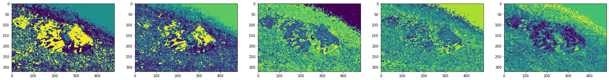

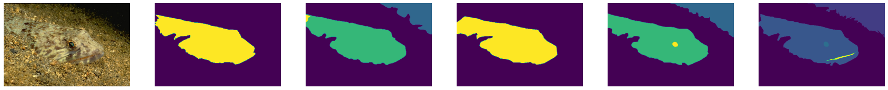

### Best entropy at k = 5

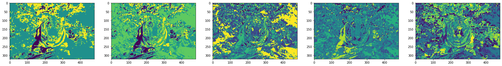


### Best entropy at k = 7

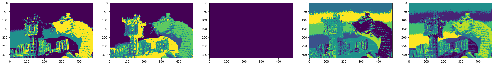


### Best entropy at k = 9

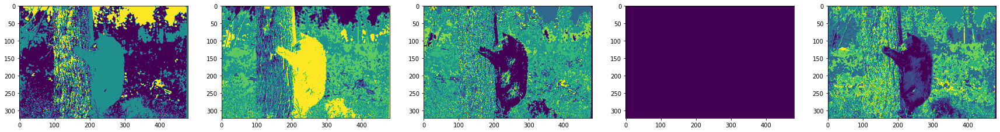

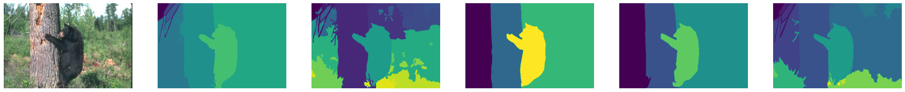

### Best entropy at k = 11

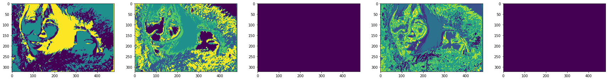


### Best F-measure at k = 3


### Best F-measure at k = 5

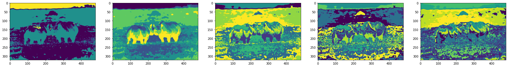


### Best F-measure at k = 7

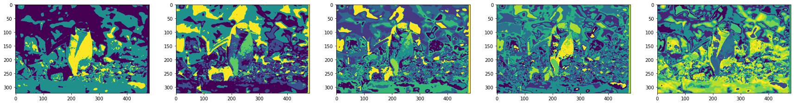


### Best F-measure at k = 9


### Best F-measure at k = 11


### Worst entropy at k = 3

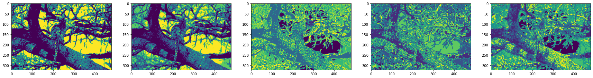


### Worst entropy at k = 5


### Worst entropy at k = 7

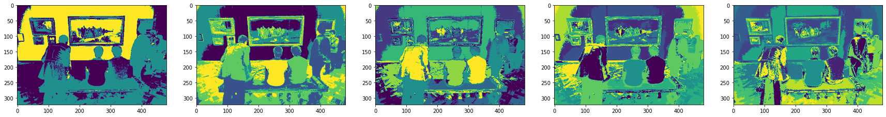


### Worst entropy at k = 9


### Worst entropy at k = 11

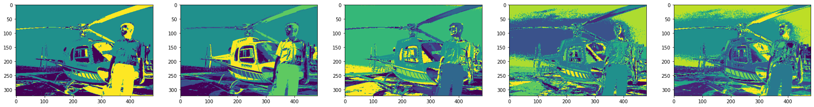


### Worst F-measure at k = 3

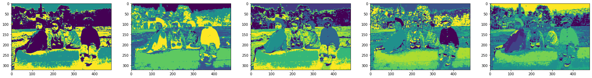


### Worst F-measure at k = 5

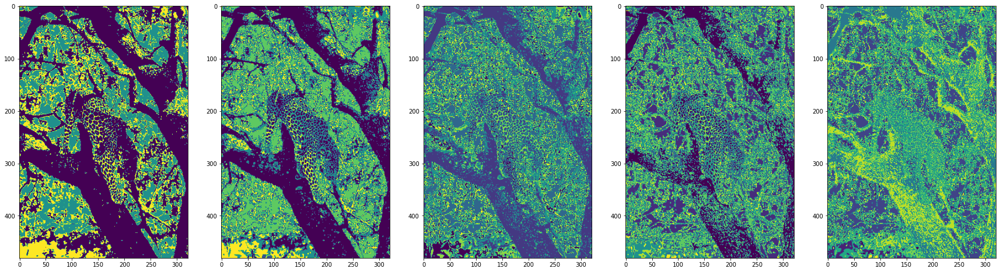

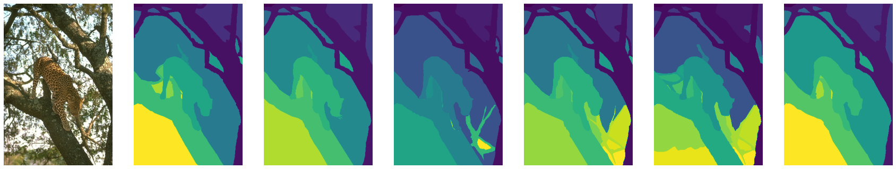

### Worst F-measure at k = 7


### Worst F-measure at k = 9

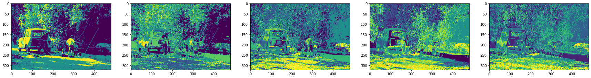


### Worst F-measure at k = 11

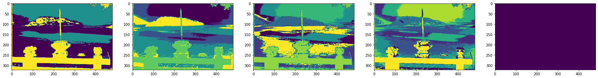


## Encoding Spatial Information

We perform the previous steps again, but this time we encode the pixel locations `(x,y)` in the feature vector. We normalize the pixel locations and give them a weight of `0.6`.

```python
def encode_position(img):
  img_indices = np.zeros((img.shape[:-1]+(5,)))
  img_indices[:,:,:3] = img

  row,col = np.indices((img.shape[:2]))
  img_indices[:,:,3] = row / img.shape[0] / 1.5
  img_indices[:,:,4] = col / img.shape[1] / 1.5

  return img_indices
```

Then, we run the same code but pass a parameter `position = True` to the previously mentioned step of classifying.

## Results of spatial encoded clustering

K-means image segmentation for the whole dataset results in an average F-measure of
_0.22_, and an average conditional entropy of _23.09_.

![measures-pos][measures]

```text
 k = 0
	 	  m = 0
	 	 	 F-measure = 0.4348674289562684
	 	 	 Conditional Entropy = 0.0
	 	  m = 1
	 	 	 F-measure = 0.4348488120555046
	 	 	 Conditional Entropy = 0.0
	 	  m = 2
	 	 	 F-measure = 0.2525853098617235
	 	 	 Conditional Entropy = 0.0
	 	  m = 3
	 	 	 F-measure = 0.15021576914521445
	 	 	 Conditional Entropy = 0.0
	 	  m = 4
	 	 	 F-measure = 0.4284766412196494
	 	 	 Conditional Entropy = 2.0176769805662103
Average F-measure = 0.340198792247672
Average Conditional Entropy = 0.4035353961132421
	 k = 1
	 	  m = 0
	 	 	 F-measure = 0.4348674289562684
	 	 	 Conditional Entropy = 0.0
	 	  m = 1
	 	 	 F-measure = 0.4348488120555046
	 	 	 Conditional Entropy = 0.0
	 	  m = 2
	 	 	 F-measure = 0.6291311929128804
	 	 	 Conditional Entropy = 2.403090506846218
	 	  m = 3
	 	 	 F-measure = 0.3791047687736945
	 	 	 Conditional Entropy = 4.005150844743697
	 	  m = 4
	 	 	 F-measure = 0.6331449872703923
	 	 	 Conditional Entropy = 2.403090506846218
Average F-measure = 0.502219437993748
Average Conditional Entropy = 1.7622663716872267
	 k = 2
	 	  m = 0
	 	 	 F-measure = 0.6702526611182309
	 	 	 Conditional Entropy = 0.7948745570183104
	 	  m = 1
	 	 	 F-measure = 0.6701310583901864
	 	 	 Conditional Entropy = 0.7948745570183104
	 	  m = 2
	 	 	 F-measure = 0.7425348899898033
	 	 	 Conditional Entropy = 2.7928049253454064
	 	  m = 3
	 	 	 F-measure = 0.4471087471534692
	 	 	 Conditional Entropy = 4.654674875575678
	 	  m = 4
	 	 	 F-measure = 0.7467258601490089
	 	 	 Conditional Entropy = 2.7928049253454064
Average F-measure = 0.6553506433601398
Average Conditional Entropy = 2.3660067680606223
	 k = 3
	 	  m = 0
	 	 	 F-measure = 0.7137964902778346
	 	 	 Conditional Entropy = 1.1520831195260315
	 	  m = 1
	 	 	 F-measure = 0.7123294287159965
	 	 	 Conditional Entropy = 1.1520831195260315
	 	  m = 2
	 	 	 F-measure = 0.731551851087162
	 	 	 Conditional Entropy = 2.7841198623958956
	 	  m = 3
	 	 	 F-measure = 0.43888631910790465
	 	 	 Conditional Entropy = 4.640199770659827
	 	  m = 4
	 	 	 F-measure = 0.7332403500496202
	 	 	 Conditional Entropy = 2.7841198623958956
Average F-measure = 0.6659608878477037
Average Conditional Entropy = 2.5025211469007362
	 k = 4
	 	  m = 0
	 	 	 F-measure = 0.6293791901603694
	 	 	 Conditional Entropy = 0.7357545498724573
	 	  m = 1
	 	 	 F-measure = 0.6285437186086814
	 	 	 Conditional Entropy = 0.7357545498724573
	 	  m = 2
	 	 	 F-measure = 0.7121907855506712
	 	 	 Conditional Entropy = 2.6663618227633594
	 	  m = 3
	 	 	 F-measure = 0.42718057907509754
	 	 	 Conditional Entropy = 4.443936371272265
	 	  m = 4
	 	 	 F-measure = 0.7136915299695055
	 	 	 Conditional Entropy = 2.6663618227633594
Average F-measure = 0.622197160672865
Average Conditional Entropy = 2.2496338233087796
```

The following are the average results for each number of clusters per image.

### F-measure

|    k=3     |    k=5     |    k=7     |    k=9     |    k=11    |
| :--------: | :--------: | :--------: | :--------: | :--------: |
| 0.18059273 | 0.2771116  | 0.33175284 | 0.3293833  | 0.45084506 |
| 0.17958646 | 0.3091027  | 0.3555887  | 0.34932023 | 0.3699309  |
| 0.43853486 | 0.54151595 | 0.5348212  | 0.5443254  | 0.5608779  |
| 0.13200991 | 0.16422804 | 0.20625786 | 0.21252185 | 0.22649384 |
| 0.1297009  | 0.18439293 | 0.27399683 | 0.27380753 | 0.30565193 |
| 0.07465418 | 0.10368318 | 0.14467335 | 0.17228197 | 0.19326453 |
| 0.04096096 | 0.0569514  | 0.05958315 | 0.0684364  | 0.08323054 |
| 0.21052143 | 0.43546537 | 0.4436726  | 0.45574597 | 0.46307522 |
| 0.16653335 | 0.23280022 | 0.3641327  | 0.37122405 | 0.39011472 |
| 0.12118946 | 0.17727867 | 0.20684002 | 0.27245358 | 0.29650033 |
| 0.07726093 | 0.15104038 | 0.15392308 | 0.16204488 | 0.16405399 |
| 0.12347353 | 0.1726279  | 0.19328211 | 0.2520385  | 0.25824907 |
| 0.16909258 | 0.25933674 | 0.29365465 | 0.28859985 | 0.42709345 |
| 0.3292219  | 0.38214904 | 0.40451908 | 0.48257157 | 0.5337167  |
| 0.34303796 | 0.54580337 | 0.5637381  | 0.54897356 | 0.55178916 |
| 0.12973669 | 0.15613657 | 0.16988117 | 0.17106669 | 0.20922221 |
| 0.06581187 | 0.16339225 | 0.1907204  | 0.22307514 | 0.24739385 |
| 0.07272913 | 0.11497132 | 0.15582368 | 0.16133952 | 0.16574772 |
| 0.35515004 | 0.36014423 | 0.36744604 | 0.3835692  | 0.3813954  |
| 0.11336655 | 0.1274734  | 0.13533929 | 0.1393878  |  0.145559  |
| 0.34019879 | 0.50221944 | 0.6553506  | 0.6659609  | 0.62219715 |
| 0.35808912 | 0.33391204 | 0.36693928 | 0.5594958  | 0.48510006 |
| 0.37761924 | 0.4270351  | 0.55649817 | 0.5526192  |  0.592158  |
| 0.05478765 | 0.07568603 | 0.07515753 | 0.09399363 | 0.13622504 |
| 0.09001761 | 0.14056228 | 0.17448242 | 0.17718904 | 0.23591611 |
| 0.09709416 | 0.1383827  | 0.14372295 | 0.1860296  | 0.20426789 |
| 0.09954485 | 0.15548477 | 0.16829066 | 0.1816257  | 0.18099679 |
| 0.06183137 | 0.09678435 | 0.10819542 | 0.14768583 | 0.18760608 |
| 0.08898831 | 0.16041379 | 0.17830935 | 0.19471294 | 0.2431095  |
| 0.05279624 | 0.07928046 | 0.09613603 | 0.10836567 | 0.1394241  |
| 0.08785144 | 0.18279514 | 0.22700264 | 0.27034533 | 0.2937128  |
| 0.0458395  | 0.06412337 | 0.07827622 | 0.09108486 | 0.15354918 |
| 0.28982744 | 0.3449411  | 0.38865617 | 0.41296524 | 0.45416248 |
| 0.13857359 | 0.1456915  | 0.20468767 | 0.2037583  | 0.22952908 |
| 0.05928806 | 0.11399817 | 0.18648416 | 0.21313977 | 0.20825109 |
| 0.07018438 | 0.08760896 | 0.09569979 | 0.10450273 | 0.10973325 |
| 0.12926836 | 0.1714888  | 0.18003897 | 0.23816675 | 0.2847113  |
| 0.06254258 | 0.09066985 | 0.13117047 | 0.15813898 | 0.15239632 |
| 0.13685597 | 0.14172296 | 0.19897649 | 0.21565233 | 0.28693148 |
| 0.05587532 | 0.06105983 | 0.1296354  | 0.16080837 | 0.1642125  |
| 0.38528737 | 0.4449299  | 0.50527704 | 0.50069535 | 0.52033985 |
| 0.25511965 | 0.29537526 | 0.30025247 | 0.34282017 | 0.3463173  |
| 0.04963747 | 0.08339827 | 0.10195982 | 0.11966082 | 0.12716492 |
| 0.09375481 | 0.14016952 | 0.13936266 | 0.17666517 | 0.19372757 |
| 0.03351981 | 0.07384573 | 0.08712956 | 0.13831428 | 0.14485973 |
| 0.07622524 | 0.14590546 | 0.15709454 | 0.19617446 | 0.2322743  |
| 0.08265075 | 0.1023494  | 0.14214149 | 0.17292543 | 0.17522363 |
| 0.05991735 | 0.06823841 | 0.06942925 | 0.12405573 | 0.15981473 |
| 0.11140306 | 0.18263441 | 0.20653509 | 0.2220609  | 0.2267094  |
| 0.06230721 | 0.08879512 | 0.08892003 | 0.09595703 | 0.1092335  |

#### Best 5 F scores

|    k=3     |    k=5     |    k=7     |    k=9     |    k=11    |
| :--------: | :--------: | :--------: | :--------: | :--------: |
| 0.35515004 | 0.43546537 | 0.50527704 | 0.5443254  | 0.5337167  |
| 0.35808912 | 0.4449299  | 0.5348212  | 0.54897356 | 0.55178916 |
| 0.37761924 | 0.50221944 | 0.55649817 | 0.5526192  | 0.5608779  |
| 0.38528737 | 0.54151595 | 0.5637381  | 0.5594958  |  0.592158  |
| 0.43853486 | 0.54580337 | 0.6553506  | 0.6659609  | 0.62219715 |

#### Worst 5 F scores

|    k=3     |    k=5     |    k=7     |    k=9     |    k=11    |
| :--------: | :--------: | :--------: | :--------: | :--------: |
| 0.03351981 | 0.0569514  | 0.05958315 | 0.0684364  | 0.08323054 |
| 0.04096096 | 0.06105983 | 0.06942925 | 0.09108486 | 0.10923355 |
| 0.0458395  | 0.06412337 | 0.07515753 | 0.09399363 | 0.10973325 |
| 0.04963747 | 0.06823841 | 0.07827622 | 0.09595703 | 0.12716492 |
| 0.05279624 | 0.07384573 | 0.08712956 | 0.10450273 | 0.13622504 |

> **Note**:
>
> `k > 5` produce _better_ F scores than `K <= 5` in
> general.

### Conditional Entropy

|    k=3    |    k=5    |    k=7     |    k=9    |   k=11    |
| :-------: | :-------: | :--------: | :-------: | :-------: |
|  5.64001  | 10.997446 | 11.865977  | 11.999476 | 12.977743 |
| 20.079723 | 23.697992 | 27.360456  | 30.96665  | 33.92871  |
| 6.6696334 | 8.235084  |  7.955377  | 8.167064  | 8.175035  |
| 9.660816  | 13.513311 | 15.588675  | 15.749169 | 16.011156 |
| 5.611318  | 8.505545  | 13.406973  | 12.627843 | 13.920888 |
| 9.275162  | 13.045136 |  18.97156  | 23.286985 | 27.082642 |
| 5.7498045 | 19.369759 | 23.485142  | 28.69009  | 28.611685 |
| 3.5791008 | 10.002711 |  9.86322   | 10.136399 |  9.80491  |
| 5.348195  | 7.0229354 | 11.450007  | 10.862357 | 11.441945 |
| 11.709707 | 13.642949 | 15.120261  | 20.330606 | 19.072525 |
| 3.8306315 | 15.092967 | 13.1012745 | 13.572239 | 14.959242 |
| 13.958701 | 19.29745  | 17.177477  | 18.400711 | 18.926136 |
|    0.     | 2.562468  | 3.3890636  | 2.8416865 | 4.628664  |
| 5.697242  | 7.052117  | 7.4670134  | 8.445903  | 8.190651  |
| 1.2158123 | 2.2189517 | 2.3814116  | 2.1605709 | 2.1418297 |
| 16.485193 | 17.944538 | 19.886126  | 20.171759 | 22.741564 |
| 2.4408667 | 14.06828  | 16.061066  | 18.331776 | 20.534494 |
| 12.528585 | 23.230083 | 28.036825  | 27.853163 | 27.911793 |
| 10.720579 |  10.2008  |  7.787796  | 7.8213935 | 6.899288  |
| 14.169533 | 14.709523 |  15.74502  | 16.44643  | 16.393183 |
| 0.4035354 | 1.7622664 | 2.3660069  | 2.502521  | 2.2496338 |
| 1.1043178 | 1.1037788 | 3.8717692  | 6.3685966 | 5.537747  |
| 1.5740457 | 3.095937  |  4.546377  |  4.02241  | 4.7969646 |
| 34.18059  | 45.727894 | 44.501427  | 53.189346 | 57.818897 |
| 12.680617 | 19.999018 | 22.771414  | 22.266914 | 26.322834 |
| 26.607237 | 31.643764 |  33.55516  | 38.411194 | 38.498165 |
| 32.399998 | 38.474617 |  43.48842  | 44.222095 | 44.875046 |
| 12.050345 | 15.81915  | 22.208155  | 29.348925 | 33.156784 |
| 28.539282 | 41.768745 | 45.254543  | 47.725826 | 49.724895 |
| 21.606707 | 35.849636 |  44.59899  | 50.036922 | 58.98802  |
| 15.753839 | 25.61386  | 27.457884  | 29.736553 | 29.588413 |
| 42.66935  | 49.978226 |  58.61483  | 59.87614  |   71.94   |
| 7.3664093 | 13.218499 | 14.789676  | 14.976498 |  16.2671  |
| 15.291438 | 17.861109 | 21.809889  | 21.115475 | 23.499653 |
| 50.81515  | 69.94575  |  79.16351  | 85.499855 | 90.325134 |
| 25.375454 | 29.985659 | 29.430246  | 28.789686 | 29.945934 |
| 23.762579 | 27.789427 |  29.28222  | 35.75267  | 39.216564 |
| 15.802749 | 23.367361 | 29.752596  | 34.633953 | 32.24832  |
| 4.2327337 | 7.0258074 | 10.472492  | 11.595221 | 14.969658 |
|    0.     | 1.2694029 |  9.073605  | 13.927291 | 12.625638 |
| 3.1600955 | 4.017059  |  4.359214  | 3.922901  | 4.1375346 |
| 4.837985  | 5.886115  | 6.9088736  | 6.752637  | 6.6317225 |
| 28.917627 | 40.265656 | 47.816864  | 51.97638  | 53.442055 |
| 25.638945 | 35.807728 | 35.371983  | 36.687237 | 37.769722 |
| 37.58074  | 65.45259  |  71.97309  | 88.32618  | 86.67983  |
| 23.382565 | 30.358782 | 30.495464  | 34.83673  | 37.685135 |
| 28.96659  | 36.316235 | 42.671318  | 49.540836 | 47.40385  |
| 35.161224 | 44.74947  |  44.44472  | 67.63068  | 69.93748  |
|  19.7891  | 24.881264 | 27.050613  | 29.456991 | 28.98193  |
| 21.71162  | 29.887344 |  29.48137  | 29.986748 | 30.812515 |

#### Best 5 Entropies

|    k=3    |    k=5    |    k=7    |    k=9    |   k=11    |
| :-------: | :-------: | :-------: | :-------: | :-------: |
|    0.     | 1.1037788 | 2.3660069 | 2.1605709 | 2.1418297 |
|    0.     | 1.2694029 | 2.3814116 | 2.502521  | 2.2496338 |
| 0.4035354 | 1.7622664 | 3.3890636 | 2.8416865 | 4.1375346 |
| 1.1043178 | 2.2189517 | 3.8717692 | 3.922901  | 4.628664  |
| 1.2158123 | 2.562468  | 4.359214  |  4.02241  | 4.7969646 |

#### Worst 5 Entropies

|    k=3    |    k=5    |    k=7    |    k=9    |   k=11    |
| :-------: | :-------: | :-------: | :-------: | :-------: |
| 34.18059  | 44.74947  | 45.254543 | 53.189346 | 58.98802  |
| 35.161224 | 45.727894 | 47.816864 | 59.87614  | 69.93748  |
| 37.58074  | 49.978226 | 58.61483  | 67.63068  |   71.94   |
| 42.66935  | 65.45259  | 71.97309  | 85.499855 | 86.67983  |
| 50.81515  | 69.94575  | 79.16351  | 88.32618  | 90.325134 |

> **Note:**
>
> The entropies of value `0` could be a result of maxmatching a
> number of labels that is larger than the number of clusters `K`,
> where multiple labels are assigned to the same cluster.

#### Images

##### Best Entropy at k = 3


##### Best Entropy at k = 5


##### Best Entropy at k = 7


##### Best Entropy at k = 9


##### Best Entropy at k = 11


##### Best F-measure at k = 3


##### Best F-measure at k = 5


##### Best F-measure at k = 7


##### Best F-measure at k = 9


##### Best F-measure at k = 11


##### Worst Entropy at k = 3


##### Worst Entropy at k = 5


##### Worst Entropy at k = 7


##### Worst Entropy at k = 9


##### Worst Entropy at k = 11


##### Worst F-measure at k = 3


##### Worst F-measure at k = 5


##### Worst F-measure at k = 7


##### Worst F-measure at k = 9


##### Worst F-measure at k = 11


## Conclusion

|       metric        | k-means | spatial k-means | spectral clustering |
| :-----------------: | :-----: | :-------------: | :-----------------: |
|      F-measure      |  0.17   |      0.22       |       0.0000        |
| Conditional Entropy |  19.22  |      23.09      |       0.0000        |

We conclude that

1. Conditional entropy is not a good metric for evaluating image segmentation.
2. According to the F-measure, the spatial k-means algorithm performs better than the k-means algorithm.
3. For spatial k-means, according to F-measure the best values for `K` are greater than `5`.

## Big picture

a)
```python
for i in range(0,5):
 plt.imshow(k_means(5,x_test[i],position = True))
 print("kmean of image "+str(i))
 disp_img_truth(x_test[i],y_test[i],edges=False)
 print("ground truth of image "+str(i))
```

![K0][K0]

![K1][K1]

![K2][K2]

![K3][K3]

![K4][K4]

the model can differentiate better when the image has less features and more contrast between the colors ,also in plane image since it has more details the model couldn't differentiate it as an object but it recognized some details and edges.

b)
```python
from sklearn.cluster import SpectralClustering
from skimage.transform import resize
import scipy
def Ncut(img):
    #img = resize(img, 0.3) / 255
    n = img.shape[0]
    m = img.shape[1]
    img = img.reshape(-1, img.shape[-1])
    labels = SpectralClustering(n_clusters=5,
                                  affinity='nearest_neighbors',
                                  gamma=1,
                                  n_neighbors=5,
                                  eigen_solver='amg',n_components=None
                                  ).fit_predict(img)
    labels = labels.reshape(n,m)


    plt.figure(figsize=(12, 12))
    plt.axis('off')
    plt.imshow(labels)
 for i in range(0,5):
	 Ncut(x_test[i])
	 plt.title("normalized cut for image "+str(i))
	 plt.figure()
	 disp_img_truth(x_test[i],y_test[i],edges=False)
	 print("ground truth of image "+str(i))

```

![n0][n0]

![n1][n1]

![n2][n2]

![n3][n3]

![n4][n4]

normalized cut generates bad results when features have similar colors or blended in


c)
```python
for i in range(0,5):
  plt.imshow(k_means(5,x_test[i],position = True))
  plt.title("Kmeans for image "+str(i))
  plt.figure()
  t=x_test[i]/255
  Ncut(t)
  plt.title("normalized cut for image "+str(i))
  plt.figure()
```

![kn0][kn0]

![kn1][kn1]

![kn2][kn2]

![kn3][kn3]

![kn4][kn4]

kmeans is better than normalized cut in image segmentastion
<!-- References -->

  <!-- Links -->

[data]: https://www2.eecs.berkeley.edu/Research/Projects/CS/vision/grouping/resources.html#bsds500
[test_label]: https://drive.google.com/drive/folders/10aHKCE2jgUvzB8fOljdiv-IE_ocjplM5?usp=share_link
[f]: https://en.wikipedia.org/wiki/F-score
[ce]: https://en.wikipedia.org/wiki/Conditional_entropy

  <!-- Pictures -->

[explore]: img/explore.png
[segments]: img/segments.png
[edges]: img/edges.png
[kmeans]: img/kmeans.png
[maxmatch]: img/maxmatch.jpeg
[fscore]: img/fscore.jpeg
[ce-pic]: img/ce.jpeg
[measures]: img/measures.png
[K0]:img/K0.PNG
[K1]:img/K1.PNG
[K2]:img/K2.PNG
[K3]:img/K3.PNG
[K4]:img/K4.PNG
[n0]:img/n0.PNG
[n1]:img/n1.PNG
[n2]:img/n2.PNG
[n3]:img/n3.PNG
[n4]:img/n4.PNG
[kn0]:img/kn0.PNG
[kn1]:img/kn1.PNG
[kn2]:img/kn2.PNG
[kn3]:img/kn3.PNG
[kn4]:img/kn4.PNG

  <!-- Badges -->

[colab-badge]: https://colab.research.google.com/assets/colab-badge.svg
[github-badge]: https://img.shields.io/badge/GitHub-100000?logo=github&logoColor=white

  <!-- Source Code -->

[github]: http://github.com/moharamfatema/img-segmentation
[colab-notebook]: https://colab.research.google.com/github/moharamfatema/img-segmentation/blob/main/img_segmentation.ipynb
[colab-notebook-pos]: https://colab.research.google.com/github/moharamfatema/img-segmentation/blob/main/img_segmentation_pos.ipynb
[colab-notebook-spec]: https://colab.research.google.com/github/moharamfatema/img-segmentation/blob/main/spectral-clustering.ipynb
